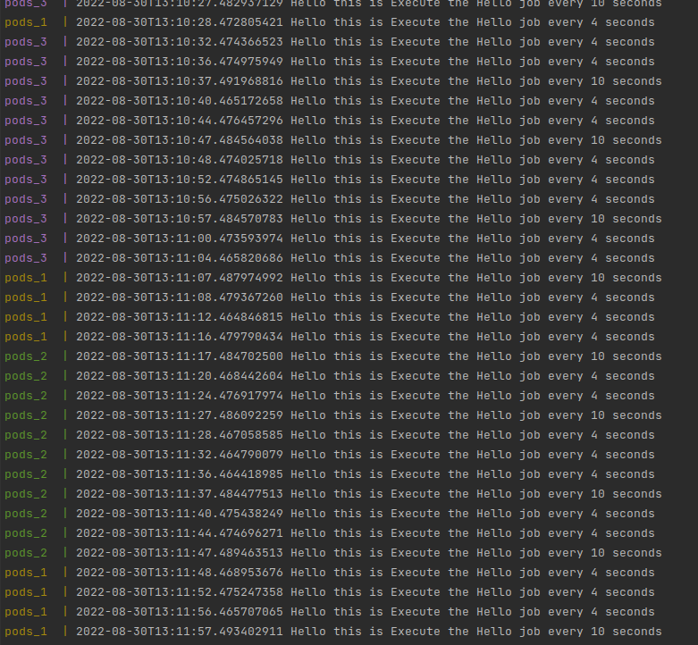
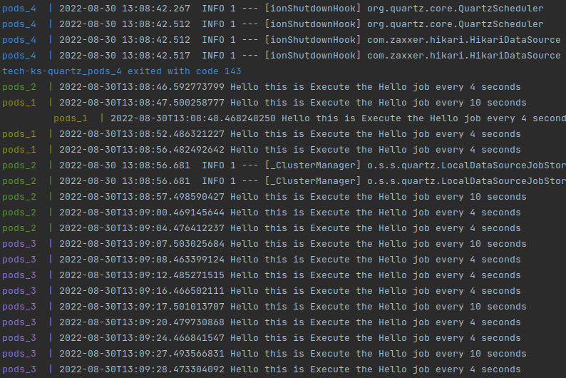

# Cronjobs & Quartz

In this project I am creating a minimum functional example of Quartz, that anybody can take inspiration from and extend,
and hopefully I can save you some headache!!

* https://www.freeformatter.com/cron-expression-generator-quartz.html
    * To translate your cron expression
* http://www.quartz-scheduler.org/
    * Quartz webpage

### Run the example

Simply write in your console

``` 
make start
```

then just do `make down` to stop

#### Requirements:

* Java 17 (yes, I'm building first the jar in your local machine)
* Docker
* docker-compose

### What is Quartz

Quartz is a quite simple straight forward framework to orchestrate your cronjob in your Springboot application.

What I'm actually using here is the _Quartz-Springboot-starter_ version, which makes configuration and setup quite
straight forward.

With this version Quartz is reusing the same data source as Spring boot is using. In case you want to have your quartz
scheduler with a different data source (maybe you use a different user with less permission), you need to specify the
data source.

### Why using Quartz

You need:

* create cron-jobs
* only 1 pod at the time execution of your cron-jobs
    * only if jobs are marked with **@DisallowConcurrentExecution** annotation
* a system that works independently of your container orchestrator (eg k8s)
* You don't care which pod is executing what cronjob

You don't want:

* maintain multiple deployment file

### Cron definitions

As you can imagine you can define very different type of schedules, only your imagination will stop you ;)!

For example

```kotlin
 CronScheduleBuilder
    .cronSchedule("0 30 3 1/1 * ? *")
    .inTimeZone(TimeZone.getTimeZone("UTC"))
```

Which translates into `At 03:30:00am, every day starting on the 1st, every month`

Simply use this website https://www.freeformatter.com/cron-expression-generator-quartz.html ;)

# Quick example

The triggers will get picked up by different services independently


And if one instance dies, as you can see the cron-jobs will get picked up by the other running services
